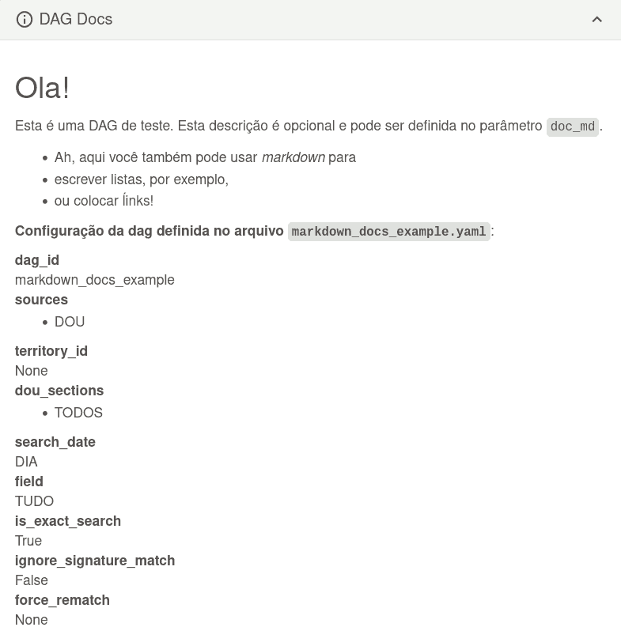

# Ro-dou

[](https://github.com/gestaogovbr/Ro-dou/actions/workflows/ci-tests.yml)

O Ro-dou é uma ferramenta para gerar dinamicamente DAGs no
[Apache Airflow](https://airflow.apache.org/) que fazem *clipping* do Diário
Oficial da União ([DOU](https://www.gov.br/imprensanacional/pt-br)) e dos Diários Oficiais de municípios por meio do Querido Diário ([QD](https://queridodiario.ok.org.br/)). Receba notificações (email, slack, discord ou outros) de todas as publicações que contenham as **palavras chaves** que você definir.

Veja uma apresentação completa no canal da ENAP no [YouTube](https://www.youtube.com/watch?v=phCa8GJOHY0),
feita na Semana de Inovação de 2021.

**Confira o histórico de alterações aqui [CHANGELOG.md](CHANGELOG.md).**

# Recursos

- Frequência **diária**, **semanal** ou **mensal**
- Relatório em `.CSV`
- Busca dinâmica das palavras chaves de um **BD** ou de uma **Variável**
- Pesquisa em **Seção** específica
- Envio de notificações para canais Discord e Slack

# Ambiente de Exemplo

Além do código fonte disponibilizamos também neste repositório uma configuração
de exemplo para que você possa executar o **Ro-dou** no seu computador. Para
isso é necessário ter o **Docker Compose** na versão 1.29 ou maior
[instalado](https://docs.docker.com/compose/install/). Após
clonar o repositório no seu computador, acesse o diretório pela linha de
comando e execute os comandos a seguir:

```bash
make run
```
Este comando baixa as imagens docker necessárias, faz build da contêiner do Ro-dou e sobe tudo.

O Airflow pode demorar alguns minutos para se configurar a primeira vez. Após
isso ele estará disponível em http://localhost:8080/. Para se autenticar
utilize o login `airflow` e a senha `airflow`. Na tela inicial estão listados
os clippings de exemplo referentes aos arquivos YAML do diretório `dag_confs/`.
No airflow eles são chamados de [DAGs](http://airflow.apache.org/docs/apache-airflow/2.2.1/concepts/dags.html).

Para executar qualquer DAG é necessário ligá-la. Inicialmente todas estão
pausadas. Comece testando o Clipping **all_parameters_example**. Utilize o
botão _toggle_ para ligá-lo. Após ligá-lo o Airflow o executará uma única vez.
Clique no [nome da DAG](http://localhost:8080/tree?dag_id=all_parameters_example)
para visualizar o detalhe da execução. Tanto na visualização em árvore
(**Tree**) como na visualização em Grafo (**Graph**) é possível constatar se
houve algum resultado encontrado na API da Imprensa Nacional para os termos e
demais parâmetros deste clipping. Se a tarefa chamada **"send_report"** estiver
na cor verde significa que houve resultado e que o email foi enviado.

Para visualizar o email acesse o endereço http://localhost:5001/. Este é um
serviço que simula uma caixa de email (servidor SMTP) para fins de
experimentação. **_Voilà!_**. O arquivo de configuração deste Clipping está na
pasta `dag_confs/`. Confira [aqui](https://github.com/gestaogovbr/Ro-dou/blob/main/dag_confs/all_parameters_example.yaml) no Github.

Agora teste o Clipping **terms_from_variable** seguindo os mesmo passos. Neste
caso os termos pesquisados estão listados em uma Variável do Airflow e podem
ser modificados pela interface gráfica. Acesse no menu **Admin >> Variables**
ou pela URL http://localhost:8080/variable/list/.

Leia a seção **Configurando em Produção** para instalar o Ro-dou utilizando um
provedor SMTP real que enviará os emails para os destinatários verdadeiros.

> [!WARNING]
> Para utilizar o `source: - INLABS` é necessário criar a conexão `inlabs_db`
> no Airflow apontando para o banco `Postgres` que está carregado com os
> dados do inlabs.
>
> Exemplo de como carregar um banco com os dados do inlabs aqui ->
> [`ro-dou_inlabs_load_pg_dag.py`](/dag_load_inlabs/ro-dou_inlabs_load_pg_dag.py).

Para desligar o Ro-dou execute o comando:

```bash
make down
```

~~# Restrições da Arquitetura~~

~~Em janeiro de 2023 a Imprensa Nacional realizou uma mudança no portal de
pesquisa do diário oficial para [bloquear](https://developers.cloudflare.com/fundamentals/get-started/reference/cloudflare-cookies/#__cf_bm-cookie-for-cloudflare-bot-products)
o acesso automatizado realizado por robôs similares ao Ro-dou. Dessa
forma, para superar essa barreira foi necessário recorrer ao uso do
**Selenium**, uma solução robusta porém que ocasiona um grande consumo de
recursos de memória RAM. Nós defendemos os princípios dos dados abertos
e enxergamos a mudança no portal do diário oficial como um retrocesso na
democratização do acesso aos dados abertos.~~

Em fevereiro de 2023 a IN desabilitou o cloudfare e a solução anterior, sem o Selenium, voltou a funcionar.

# Configurando em Produção

Para utilizar o Ro-dou em produção é necessário que o servidor tenha disponível
um serviço SMTP que será utilizado pelo Airflow para envio dos emails pela
Internet. Siga os seguintes passos:

1. Utilize as credenciais do serviço SMTP (host, usuário, senha, porta, etc)
para editar o arquivo `docker-compose.yml` substituindo as variáveis referentes
ao SMTP, a exemplo de `AIRFLOW__SMTP__SMTP_HOST`.

2. Ao final do arquivo `docker-compose.yml` remova as linhas que declaram o
serviço **smtp4dev** uma vez que ele não será mais necessário.

É isso! Agora basta subir o Ro-dou executando o comando:

```bash
make run
```

## Notificação de erros na execução das DAGs

O Ro-Dou permite envio de mensagens slack quando ocorrer alguma falha na
execução da `dag`. Para isso:

1. Criar o app no slack conforme orientações do vídeo [How to Add Slack Notifications to Your Airflow DAG's with Airflow Notifiers](https://www.youtube.com/watch?v=4yQJWnhKEa4&ab_channel=TheDataGuy).
2. Criar conexão no Airflow com a seguinte configuração:
  * `Connection Id` = `slack_notify_rodou_dagrun`
  * `Connection Type` = `Slack API`
  * `Description` = `{"channel": "nome-do-channel-pra-mandar-mensagem"}`
  * `Slack API Token` = `obtido no passo 1`

# Exemplos de Configuração YAML

### Exemplo 1
A configuração a seguir cria uma DAG que realiza a pesquisa **diária** dos
**6 termos** e envia o relatório para o **email** fornecido.

```yaml {6-10,13}
dag:
  id: pesquisa_dou_termos_interesse_nitai
  description: Pesquisa termos de interesse de Nitai.
  search:
    terms:
      - dados abertos
      - governo aberto
      - engenharia de dados
      - software livre
      - código aberto
      - open source
  report:
    emails:
      - nitaibezerra@protonmail.com
```

### Exemplo 2
Esta configuração realiza a pesquisa diária de **segunda a sexta-feira 8AM**,
apenas na **Seção 1 e na Edição Suplementar** e envia o resultado em
**formato CSV** anexado juntamente ao email. O parâmetro `schedule`
aceita valores CRON.

```yaml {4,13-14,19}
dag:
  id: dag_id_deve_ser_unico_em_todo_airflow
  description: DAG exemplo de monitoramento no DOU.
  schedule: 0 8 * * MON-FRI
  search:
    terms:
      - alocação
      - realoca
      - permuta
      - estrutura regimental
      - organização básica
    dou_sections:
      - SECAO_1
      - EDICAO_SUPLEMENTAR
  report:
    emails:
      - dest1@economia.gov.br
      - dest2@economia.gov.br
    attach_csv: True
    subject: Assunto do Email
```
Note que aqui são utilizados os parâmetros opcionais `schedule`,
`dou_section` e `attach_csv`.

### Exemplo 3
Neste caso é utilizado o parâmetro `from_db_select` em `terms` que torna
dinâmica a parametrização dos termos para pesquisa. Note também a inclusão de
`tags` que ajudam na organização e busca das DAGs no Airflow.

```yaml {4-6,9-11}
dag:
  id: dag_ultra_dinamica
  description: A pesquisa depende do select SQL.
  tags:
    - projeto_a
    - departamento_x
  search:
    terms:
      from_db_select:
        sql: SELECT text FROM schema.tabela;
        conn_id: airflow_conn_id
  report:
    emails:
      - email-destino@economia.gov.br
    subject: "[String] com caracteres especiais deve estar entre aspas"
```

### Exemplo 4
Nesta configuração é utilizado o parâmetro `from_airflow_variable` em `terms`
que também carrega dinamicamente a lista de termos, neste caso recuperando de
uma **variável do Airflow**. Aqui também é utilizado o campo `field` para
limitar as pesquisas ao campo título das publicações no DOU.

```yaml {6,7}
dag:
  id: pesquisa_a_lista_na_variavel
  description: É fácil editar a variável na interface do Airflow.
  search:
    terms:
      from_airflow_variable: nome_da_variavel_no_airflow
    field: TITULO
  report:
    emails:
      - email-destino@economia.gov.br
    skip_null: False
```
Caso não encontre nenhum resultado, será enviado email informando que
nenhum termo foi encontrado.


### Exemplo 5
Esta configuração produz uma DAG que executa apenas **uma vez por mês**, no dia
1 às 8AM, como pode ser visto no `schedule`. Ao passo que a pesquisa
no DOU é realizada nos diários oficiais do **último mês** inteiro, através do
uso do parâmetro `date`. Aqui também é utilizado o parâmetro `is_exact_search`
com valor `False` para utilizar pesquisa aproximada. Apesar de o termo buscado
"paralelpip**i**do" conter um erro de ortográfico, a busca retorna os
resultados corretos. [Veja!](https://www.in.gov.br/consulta/-/buscar/dou?q=ddm__text__21040__texto_pt_BR-paralelepipido&s=todos&exactDate=ano&sortType=0)

```yaml {4,8,9}
dag:
  id: relatorio_mensal_do_dou
  description: Envia um numero menor de emails.
  schedule: 0 8 1 * *
  search:
    terms:
      - paralelpipido
    date: MES
    is_exact_search: False
  report:
    emails:
      - email-destino@economia.gov.br
```

### Exemplo 6
Esta configuração produz uma DAG que pesquisa no Querido Diário pelos termos
pandemia, dados pessoais e prefeitura buscando apenas os resultados do Diário
Oficial de Belo Horizonte. Para conhecer o Querido Diário acesse
[https://queridodiario.ok.org.br/](https://queridodiario.ok.org.br/).

```yaml {5,6,7}
dag:
  id: dou_qd_example
  description: DAG de teste
  search:
    sources:
    - QD
    territory_id: 3106200 # Belo Horizonte
    terms:
    - pandemia
    - dados pessoais
    - prefeitura
  report:
    emails:
      - destination@economia.gov.br
    attach_csv: True
    subject: "Teste do Ro-dou"
```

### Exemplo 7
Esta configuração produz uma DAG exatamente igual ao exemplo básico, mas
adiciona uma descrição longa do que a DAG faz, usando o parâmetro
`doc_md`. Essa descrição pode conter formatação markdown, incluindo
títulos, listas, links, etc.

Além disso, acrescenta também uma referência ao nome do arquivo que
gerou a DAG bem como os seus parâmetros.

```yaml {13-21}
dag:
  id: markdown_docs_example
  description: DAG com documentação em markdown
  search:
    terms:
    - dados abertos
    - governo aberto
    - lei de acesso à informação
  report:
    emails:
      - destination@economia.gov.br
    subject: "Teste do Ro-dou"
  doc_md: >-
    ## Ola!

    Esta é uma DAG de exemplo com documentação em markdown. Esta
    descrição é opcional e pode ser definida no parâmetro `doc_md`.

      * Ah, aqui você também pode usar *markdown* para
      * escrever listas, por exemplo,
      * ou colocar [links](graph)!
```

Para ver essa documentação, basta clicar o botão "DAG Docs" em qualquer
tela de visualização da DAG no Airflow.



### Exemplo 8
Esta configuração envia as notificações para canais Discord. É necessário ter
permissões de administrador no Discord para gerar o Webhook:

```yaml {11}
dag:
  id: discord_example
  description: Envia notificações para canal Discord
  search:
    terms:
    - manifestação cultural
    - expressão cultural
    - política cultural
  report:
    report:
    discord:
      webhook: https://discord.com/api/webhooks/105220xxxxxx811250/Q-XsfdnoHtudTQ-8A6zzzzznitai-vi0bGLE7xxxxxxxxxxxxxxxxxxxmx94R3oZ1h0ngl1
```

### Exemplo 9
Esta configuração envia as notificações para canais Slack. É necessário ter
permissões de administrador no Slack para gerar o Webhook:

```yaml {11}
dag:
  id: slack_example
  description: Envia notificações para canal Slack
  search:
    terms:
    - manifestação cultural
    - expressão cultural
    - política cultural
  report:
    report:
    slack:
      webhook: https://hooks.slack.com/services/XXXXXXXX/XXXXNFDXXX/n6QXXXXrPwxQ71ZXXXXXT9
```

### Exemplo 10
Esta configuração filtra os resultados por órgão/unidade selecionados.
Por enquanto disponível apenas para as pesquisas no DOU.

```yaml {11}
dag:
  id: department_example
  description: DAG de teste (filtro por departamento)
  search:
    terms:
      - dados abertos
    department:
      - Ministério da Gestão e da Inovação em Serviços Públicos
      - Ministério da Defesa
  report:
    emails:
      - destination@economia.gov.br
    subject: "Teste do Ro-dou"
```

## Compreendendo um pouco mais a pesquisa no DOU

Todos os parâmetros disponíveis para pesquisa foram criados a partir da API da
Imprensa Nacional que por sua vez é utilizada pelo buscador oficial do DOU em
https://www.in.gov.br/consulta/. Ou seja, o Ro-dou consegue automatizar todo,
ou quase todo, tipo de pesquisa que pode ser feita no site do DOU. A imagem
abaixo é o painel de pesquisa avançada do site:


# Parâmetros de pesquisa disponíveis

Por padrão, caso omitido, o valor  do parâmetro `dou_section` é **TODOS**. Ou
seja, a pesquisa é feita em todas as seções do DOU. Este campo aceita mais de
uma opção.
* `dou_sections`:
  * SECAO_1
  * SECAO_2
  * SECAO_3
  * EDICAO_EXTRA
  * EDICAO_SUPLEMENTAR
  * TODOS


* `date`:
  * DIA
  * SEMANA
  * MES
  * ANO


* `field`:
  * TUDO
  * TITULO
  * CONTEUDO

