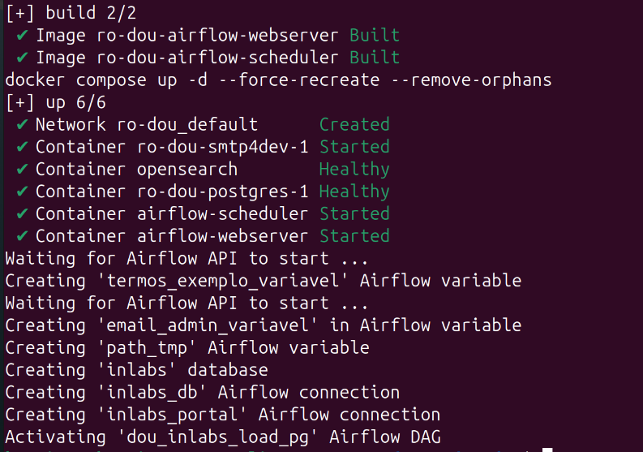

## Instalação e configuração

Este guia mostra como instalar e executar o Ro-DOU localmente para experimentação e desenvolvimento. Ao final, você terá o ambiente completo rodando em containers Docker, com um clipping de exemplo já configurado.

**Tempo estimado:** 10 a 15 minutos (a primeira inicialização dos containers pode levar alguns minutos).

Prefere acompanhar em vídeo? Os tutoriais abaixo cobrem o passo a passo de instalação:

<iframe width="560" height="315" src="https://www.youtube.com/embed/6QUHxOe9v20?si=4O4hJhltwgOiUHgc" title="Como instalar o Ro-DOU" frameborder="0" allow="accelerometer; autoplay; clipboard-write; encrypted-media; gyroscope; picture-in-picture; web-share" referrerpolicy="strict-origin-when-cross-origin" allowfullscreen></iframe>

<iframe width="560" height="315" src="https://www.youtube.com/embed/WWt6lrnfEXE?si=uV_tKSfHHDolufgm" title="Vídeo orientado para instalação" frameborder="0" allow="accelerometer; autoplay; clipboard-write; encrypted-media; gyroscope; picture-in-picture; web-share" referrerpolicy="strict-origin-when-cross-origin" allowfullscreen></iframe>

O código-fonte está disponibilizado no perfil do <a href="https://github.com/gestaogovbr/Ro-dou"></a> do Ministério da Gestão e da Inovação em Serviços Públicos.

### Pré-requisitos

* 4Gb de memória RAM
* 2Gb de espaço em disco
* Sistema operacional Linux, macOS ou Windows com WSL
* [Docker e Docker Compose](https://docs.docker.com/compose/install/) (Docker Compose versão 1.29 ou superior)

**⚠️ Usuários de Windows:** recomenda-se utilizar o [WSL (Windows Subsystem for Linux)](https://learn.microsoft.com/pt-br/windows/wsl/). Antes de continuar, confirme que:

* [o WSL está instalado e configurado](instalacao_wsl_windows.md);
* [o Docker está habilitado no WSL](habilitacao_docker_no_wsl.md).

### 1. Clonando o repositório

Abra o terminal e execute:

```bash
git clone https://github.com/gestaogovbr/Ro-dou
cd Ro-dou
```

### 2. Iniciando o ambiente

O repositório já vem com comandos pré-definidos no `Makefile` para facilitar a execução. Para iniciar todos os serviços necessários, rode:

```bash
make run
```

**💡 Dica:** este comando baixa as imagens Docker, builda o container do Ro-DOU e configura automaticamente as variáveis de ambiente e conexões do Airflow — não é necessário nenhum passo manual adicional.

Você deverá ver uma saída parecida com esta:



Se esta não for a primeira execução, os bancos e conexões já existirão e você verá mensagens como:

```bash
psql:/sql/init-db.sql:1: ERROR:  database "inlabs" already exists
psql:/sql/init-db.sql:5: NOTICE:  schema "dou_inlabs" already exists, skipping
psql:/sql/init-db.sql:35: NOTICE:  relation "article_raw" already exists, skipping
```

Isso é esperado e não indica um problema — o Ro-DOU verifica o que já existe antes de criar novamente.

### 3. Confirmando que o Airflow está no ar

O Apache Airflow — do qual o Ro-DOU depende — pode levar alguns minutos para subir na primeira inicialização. Aguarde e acesse:

[http://localhost:8080/](http://localhost:8080/)

Autentique-se com usuário `airflow` e senha `airflow`.

### 4. Ativando o clipping de exemplo

Na tela inicial do Airflow, você verá clippings de exemplo já configurados a partir dos arquivos YAML do diretório `dag_confs/`. Vamos ativar um deles para testar o ambiente:

1. Localize a DAG **all_parameters_example** e ative-a pelo botão _toggle_ (todas as DAGs começam pausadas por padrão).
2. Após ativá-la, o Airflow executa a DAG uma única vez. Clique no [nome da DAG](http://localhost:8080/tree?dag_id=all_parameters_example) para ver o detalhe da execução.
3. Na visualização em árvore (**Tree**) ou em grafo (**Graph**), verifique a task **send_report**: se estiver verde, foi encontrado um resultado na API da Imprensa Nacional e um e-mail foi enviado ao endereço configurado no YAML.

### 5. Visualizando o clipping

Acesse [http://localhost:5001/](http://localhost:5001/) — um serviço que simula uma caixa de e-mail (servidor SMTP) para fins de experimentação — e veja a mensagem recebida. **_Voilà!_**

### 6. Encerrando o ambiente

Quando terminar de utilizar o ambiente de teste, desligue-o com:

```bash
make down
```

Você pode subir o ambiente novamente a qualquer momento com `make run`.

---

## Próximos passos

* Quer criar seus próprios clippings? Use o [Gerador de configuração (YAML)](../gerador_yaml.html) pela interface web, ou rode `make gerar-yml` no terminal — ele pergunta os campos passo a passo, valida com as mesmas regras do Ro-DOU e salva o arquivo direto em `dag_confs/`. Veja o [vídeo tutorial do gerador e da CLI](https://www.youtube.com/embed/FVf3pC0rOWw).
* Confira os [parâmetros de pesquisa](../como_funciona/parametros.md) disponíveis nos YAMLs.
* Veja exemplos prontos em [Exemplos](../como_funciona/exemplos.md).

---

## Configurações avançadas (opcional)

As seções abaixo são independentes entre si — configure apenas o que fizer sentido para o seu caso de uso.

### Usando o INLABS como fonte de dados

Para utilizar `source: - INLABS`, é necessário alterar a conexão `inlabs_portal` no Apache Airflow, apontando o usuário e senha de autenticação do portal [INLABS](https://inlabs.in.gov.br/acessar.php) (cadastre-se caso ainda não tenha usuário). A DAG responsável pelo download dos arquivos do INLABS é a **ro-dou_inlabs_load_pg**.

<iframe width="560" height="315" src="https://www.youtube.com/embed/NpumeNLBuI8?si=g_i99R2d2k23yISX" title="Utilizando o INLABS como fonte de dados-pt1" frameborder="0" allow="accelerometer; autoplay; clipboard-write; encrypted-media; gyroscope; picture-in-picture; web-share" referrerpolicy="strict-origin-when-cross-origin" allowfullscreen></iframe>

<iframe width="560" height="315" src="https://www.youtube.com/embed/0bppPCACs5Q?si=SQUs2fBJ9bOArwJD" title="Utilizando o INLABS como fonte de dados-pt2" frameborder="0" allow="accelerometer; autoplay; clipboard-write; encrypted-media; gyroscope; picture-in-picture; web-share" referrerpolicy="strict-origin-when-cross-origin" allowfullscreen></iframe>

### Backend de busca do INLABS (SQL ou OpenSearch)

O OpenSearch é um mecanismo de busca e indexação utilizado pelo Ro-DOU para realizar pesquisas textuais nas publicações do INLABS. Por padrão, o Ro-DOU utiliza o **PostgreSQL (modo SQL)**. Para alternar para o **OpenSearch**, use a variável do Airflow `RO_DOU_INLABS_USE_OPENSEARCH`.

Para criar a variável automaticamente:

```bash
make create-opensearch-variable
```

Ou crie manualmente na interface do Airflow em [http://localhost:8080/variable/list/](http://localhost:8080/variable/list/):

| Variável | Valor padrão | Descrição |
|---|---|---|
| `RO_DOU_INLABS_USE_OPENSEARCH` | `False` | Define o backend de busca do INLABS. Use `False` para PostgreSQL (SQL) ou `True` para OpenSearch. |
| `OPENSEARCH_HOST` | `http://opensearch:9200` | Endereço do serviço OpenSearch (definido no docker-compose). |
| `OPENSEARCH_USER` | `OPENSEARCH_USER` | Usuário para autenticação no OpenSearch. |
| `OPENSEARCH_PASS` | `OPENSEARCH_PASS` | Senha para autenticação no OpenSearch. |

> **Observação:** Quando o valor é `False` (padrão), o OpenSearch **não precisa estar disponível** no ambiente. A task de indexação é automaticamente ignorada na DAG `ro-dou_inlabs_load_pg`.

### Resumos automáticos com IA generativa

O Ro-DOU também suporta gerar resumos automáticos das publicações usando LLMs (OpenAI, Gemini, Claude ou Azure). Veja o guia completo — build com o provedor desejado, variáveis de API e configuração do YAML — em [Habilitando IA nos resumos](habilitando_ia.md).

---

## Referência rápida de comandos

| Comando | O que faz |
|---|---|
| `make run` | Sobe todos os containers e configura o ambiente (idempotente — pode rodar de novo a qualquer momento) |
| `make down` | Desliga todos os containers |
| `make build AI_PROVIDERS="..."` | Reconstrói a imagem incluindo suporte a provedor(es) de IA |
| `make gerar-yml` | Gera um novo arquivo de configuração YAML por um assistente interativo no terminal (requer o ambiente já rodando) |
| `make create-opensearch-variable` | Cria a variável do Airflow para usar o OpenSearch como backend de busca do INLABS |
| `make create-azure-openai-variables` | Cria as variáveis do Airflow necessárias para usar o provedor Azure OpenAI |

## Solução de problemas comuns

* **`make run` falha ou trava:** confirme que o Docker Desktop/daemon está em execução antes de rodar o comando.
* **Porta já em uso (8080 ou 5001):** verifique se outro serviço na sua máquina já está usando essas portas e finalize-o, ou libere a porta antes de rodar `make run`.
* **Airflow não carrega em http://localhost:8080/:** aguarde alguns minutos — a mensagem "Waiting for Airflow API to start" no terminal indica que o serviço ainda está subindo.
* **`make gerar-yml` retorna erro de container:** o ambiente precisa estar rodando primeiro; execute `make run` antes.
